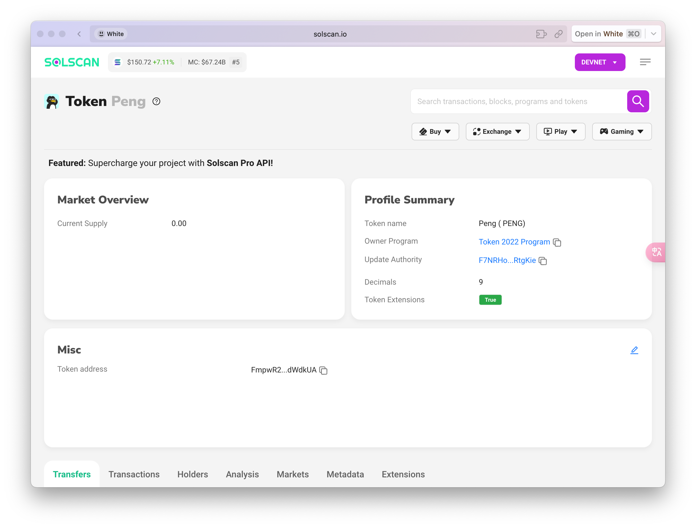
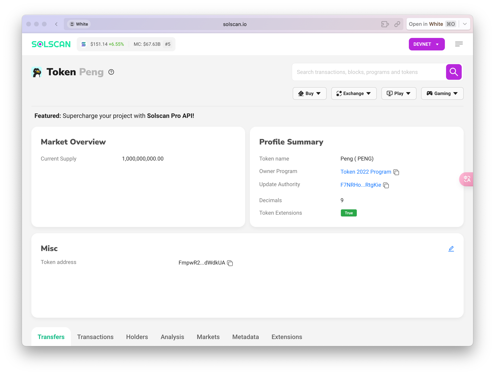

# How to Launch Token on Solana
## 0x0 前言
前一阵在Solana链上很流行发行Meme Token，由于Solana的高性能和低成本，使得Solana链上的Token发行成为了一种趋势。本文将详细介绍如何在Solana链上发行Token。
我会用两种方法来交介绍如何发行自己的Token，一种是通过官方的solana-cli，另一种是通过第三方的metaboss一键发币。以及如何在raydium上创建交易对,以及撤回交易对，实现常见的"Rug"操作。

## 0x1 准备环境
> [spl-token](https://spl.solana.com/token#setup)
> [solana-cli](https://docs.solanalabs.com/cli/install)
> [metaboss](https://metaboss.rs/installation.html)

+ Token的metadata: Token的图标、Token名字、Token Symbol、Token发行量、Token的精度、社交媒体链接(Twitter、Telegram、Discord...)等。
+ Solana钱包: 用于支付交易费用。

⚠️ 务必现在测试网进行测试，熟悉流程后再在主网上进行操作。

以下为solana-cli的常见操作:
生成新私钥并保存到指定路径
```shell
solana-keygen new -o ~/Desktop/Sol/prod3.json
```
导入私钥（切换账号）
```shell
solana config set --keypair ~/Desktop/Sol/prod3.json
```
切换为测试网
```shell
solana config set --url https://api.devnet.solana.com
```
附官方RPC节点
> DevNet: https://api.devnet.solana.com
TestNet: https://api.testnet.solana.com
MainNet: https://api.mainnet-beta.solana.com

获取当前Solana地址
```shell
solana address
```
空投1SOl,或者访问 [https://faucet.solana.com/](https://faucet.solana.com/)、[https://solfaucet.com/](https://solfaucet.com/)进行空投
```shell
solana airdrop 1
```

## 0x2 发行Token
#### 2.1 创建Token
```shell
spl-token --program-id TokenzQdBNbLqP5VEhdkAS6EPFLC1PHnBqCXEpPxuEb create-token --enable-metadata
```
output:
```shell
Creating token FmpwR2Y6Zn6yFW4bWGLk3evMZRS6QBSBHkrdfkdWdkUA under program TokenzQdBNbLqP5VEhdkAS6EPFLC1PHnBqCXEpPxuEb
To initialize metadata inside the mint, please run `spl-token initialize-metadata FmpwR2Y6Zn6yFW4bWGLk3evMZRS6QBSBHkrdfkdWdkUA <YOUR_TOKEN_NAME> <YOUR_TOKEN_SYMBOL> <YOUR_TOKEN_URI>`, and sign with the mint authority.

Address:  FmpwR2Y6Zn6yFW4bWGLk3evMZRS6QBSBHkrdfkdWdkUA
Decimals:  9

Signature: 3XvR3uSX8So6tgqnb2ybZwJ91xa76FydosoeQhX67tb96NHw2XjrA99q7G1jU1JoKswuiEbj952U2RmV278xvxrX
```
生成的`FmpwR2Y6Zn6yFW4bWGLk3evMZRS6QBSBHkrdfkdWdkUA`为token地址，可用于在Sol Scan中查询，以及后面初始化token信息和创建Token账号还会用到。
#### 2.2 创建Token的存储账号
运行以下指令创建Token存储账号，用于存储token的余额等信息，`FmpwR2Y6Zn6yFW4bWGLk3evMZRS6QBSBHkrdfkdWdkUA`为上述创建Token的地址。
```shell
spl-token create-account FmpwR2Y6Zn6yFW4bWGLk3evMZRS6QBSBHkrdfkdWdkUA
```
#### 2.2 初始化Token
首先将你准备好的Token信息整理成和下面相对应的Json格式和对应的图像文件上传到IPFS上获取访问链接。如果你想要快速且低成本的方式，可以上传到Github上，然后获取raw链接。
```json
{
  "name": "Peng",
  "symbol": "PENG",
  "image": "https://bafkreibmv7tbmuqqhm2foemzuy4o4bxqd677r3obw6igrtlmpe5k3j4oge.ipfs.nftstorage.link",
  "description": "Hi, I'm $PENG!  People tell me I look like PEPE. I tell them I'm a PENGUIN!",
  "extensions": {
    "website": "https://pengsol.xyz/",
    "twitter": "https://twitter.com/pengonsolana",
    "telegram": "https://t.me/pengonsol"
  },
  "tags": [
    "meme",
    "penguin"
  ],
  "creator": {
    "name": "DEXLAB MINTING LAB",
    "site": "https://www.dexlab.space"
  }
}
```
注意：除了name、symbol、image字段外，其他字段都是可选的。

运行指令初始化Token信息，其中`FmpwR2Y6Zn6yFW4bWGLk3evMZRS6QBSBHkrdfkdWdkUA`为Token地址, `peng`为Token的名字，`PENG`为Token的Symbol，后面为Token的metadata链接。
```shell
spl-token initialize-metadata FmpwR2Y6Zn6yFW4bWGLk3evMZRS6QBSBHkrdfkdWdkUA  Peng  PENG  https://raw.githubusercontent.com/quaffs-reclaim-0t/quaffs-reclaim-0t/main/Peng/Peng.json
```
运行成功后可在[https://solscan.io/token/FmpwR2Y6Zn6yFW4bWGLk3evMZRS6QBSBHkrdfkdWdkUA?cluster=devnet](https://solscan.io/token/FmpwR2Y6Zn6yFW4bWGLk3evMZRS6QBSBHkrdfkdWdkUA?cluster=devnet)上查看Token的metadata信息，记得将`FmpwR2Y6Zn6yFW4bWGLk3evMZRS6QBSBHkrdfkdWdkUA`替换为你的Token地址（注意这是dev测试网下的Sol Scan，记得切换为对应的网络）。

#### 2.3 Mint(发行)Token
运行以下指令mint Token，`FmpwR2Y6Zn6yFW4bWGLk3evMZRS6QBSBHkrdfkdWdkUA`为Token地址，`1000000000`为mint的数量，mint的Token会直接到当前账号。
```shell
spl-token mint FmpwR2Y6Zn6yFW4bWGLk3evMZRS6QBSBHkrdfkdWdkUA 1000000000
```
运行成功后，1000000000的token会在托管账号中，可以通过以下指令查看余额。
```shell
spl-token accounts FmpwR2Y6Zn6yFW4bWGLk3evMZRS6QBSBHkrdfkdWdkUA
```
也可以在[https://solscan.io/token/FmpwR2Y6Zn6yFW4bWGLk3evMZRS6QBSBHkrdfkdWdkUA?cluster=devnet](https://solscan.io/token/FmpwR2Y6Zn6yFW4bWGLk3evMZRS6QBSBHkrdfkdWdkUA?cluster=devnet)上查看Token的metadata信息，记得将`FmpwR2Y6Zn6yFW4bWGLk3evMZRS6QBSBHkrdfkdWdkUA`替换为你的Token地址。

可以发现Current Supply已变为1,000,000,000.00，说明已mint成功。且在钱包中可查看相应的token余额

#### 2.4 Transfer Token
运行以下指令转账Token,`FmpwR2Y6Zn6yFW4bWGLk3evMZRS6QBSBHkrdfkdWdkUA`为你的Token地址，`50`为转账数量，`vines1vzrYbzLMRdu58ou5XTby4qAqVRLmqo36NKPTg`为接收地址。
```shell
spl-token transfer FmpwR2Y6Zn6yFW4bWGLk3evMZRS6QBSBHkrdfkdWdkUA 50 vines1vzrYbzLMRdu58ou5XTby4qAqVRLmqo36NKPTg --fund-recipient
```
#### 丢弃权限
1.丢弃冻结（freeze）权限
```shell
spl-token authorize FmpwR2Y6Zn6yFW4bWGLk3evMZRS6QBSBHkrdfkdWdkUA freeze --disable
```
2.丢弃mint权限
```shell
spl-token authorize FmpwR2Y6Zn6yFW4bWGLk3evMZRS6QBSBHkrdfkdWdkUA mint --disable
```
查看token的权限信息
```shell
spl-token display FmpwR2Y6Zn6yFW4bWGLk3evMZRS6QBSBHkrdfkdWdkUA
```
⚠️ 只有丢弃mint、freeze权限后，才能在Raydium上创建交易对，否则Raydium会检测并提示权限问题。

#### 2.5 成本花费
在完成上述创建Token、初始化Token信息、mint Token、转账Token等操作后，最初空投的1SOL，还剩0.99203756 SOL。
```shell
white@WdeMacBook-Pro ~ % solana balance
0.99203756 SOL
```
所以Sol上创建Token的成本几乎可以忽略不计，几乎都是Gas成本。
## 0x3 通过Metaboss发行Token
⌛...

没想到吗的写博客这么累（还有就是Sol上这些操作是真的繁琐，当初研究这块东西教程又少，官方文档又写得莫名其妙，还到处都是坑钱的陷阱），剩下的metaboss一键发币以及Raydium创建交易对等操作，我会在后续更新...

see you next time...
## - References
- *Solana-Cli Doc&nbsp;-&nbsp;https://docs.solana.com/cli/install-solana-cli*
- *Spl-token Doc&nbsp;-&nbsp;https://spl.solana.com/token*
